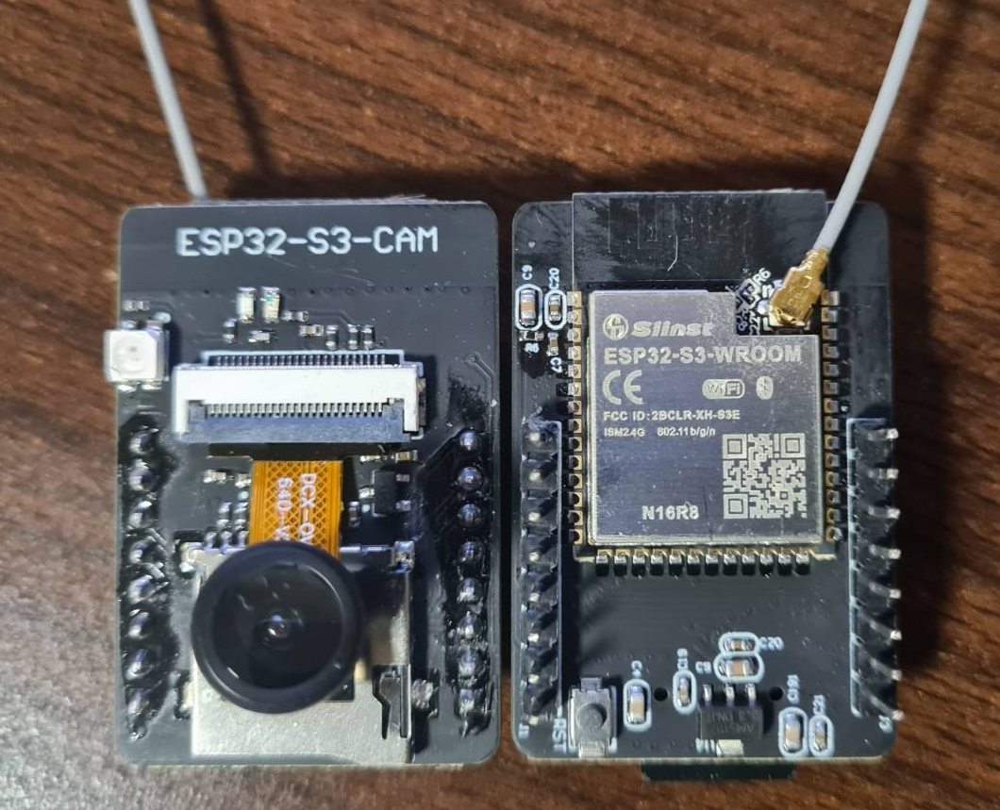
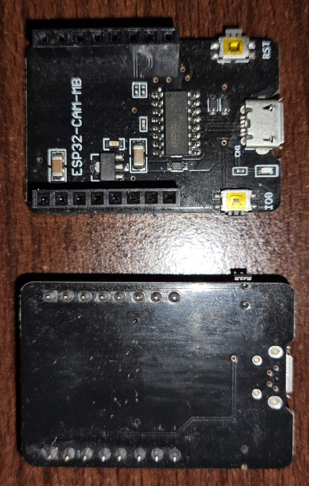
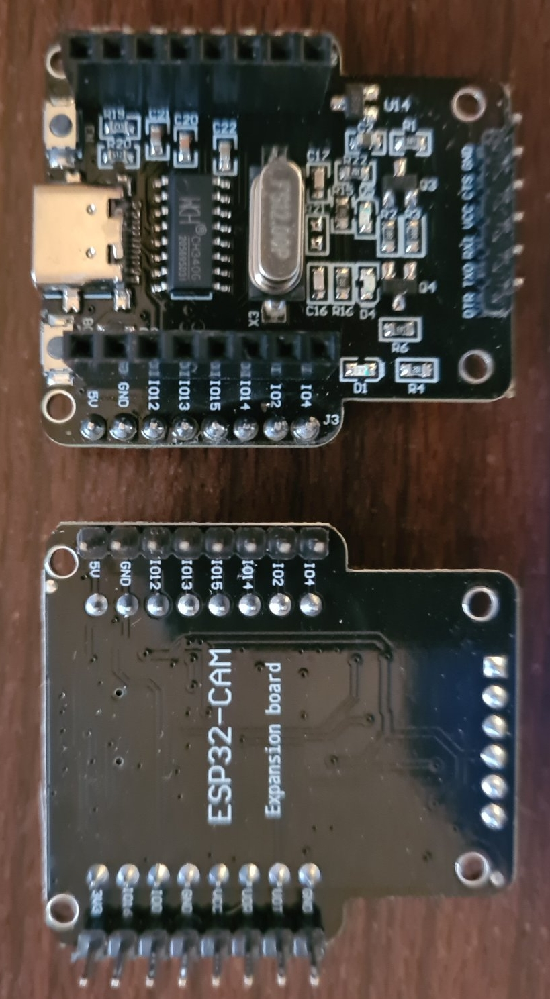
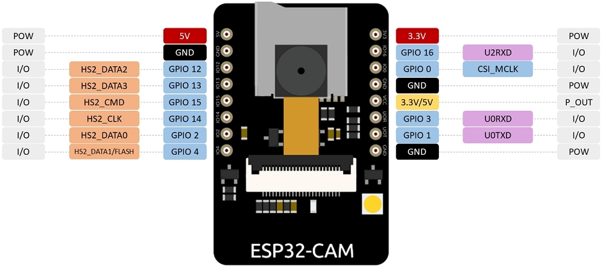

# esp32-cam
ESP32 Cam - TimeLapse, Streaming, Prusa Connect ..

## Hardware
ESP32-CAM board with OV2640 camera module, there are several hardware versions of the board
- original AI-Thinker board
- different copies, some exact some with notable differences
- S3 version with more PSRAM, faster<br>


## Flashing HW helper boards
- CH340 chip, USB micro<br>


- CH340 chip, USB C, passtru dupont connectors for prototyping<br>


## Pinout


## Instalation
Insert ESP32-CAM into helper board and connect it to PC.

### Visual Studio Code with PlatformIO IDE
<a href=doc/vsc.md>VSC with PlatformIO</a>

### Arduino IDE
Gremlins ate this part - rewrite needed ..

## Using Camera
Connect to the DHCP assigned IP and try several sublinks from next chapter!

### Notable Weblinks
Web server listening port is 8080, changed from default 80 for easier router port-mapping, configurable at start of <a href=src/asyncWebServer.cpp>Web Server code</a>
- {CAM_IP:8080}/login<br>
    enter credentials
- {CAM_IP:8080}/espReset<br>
    force complete ESP32-CAM reset
- {CAM_IP:8080}/sdcard<br>
    reinit SD Card after (re)inserting microSD
- {CAM_IP:8080}/metrics<br>
    output metrics for prometheus/grafana nerds
- {CAM_IP:8080}/scan<br>
    JSON display of neighbour WiFi SSID/Channels
- {CAM_IP:8080}/archive<br>
    browse saved timelapse pictures
- {CAM_IP:8080}/prusa<br>
    force upload of last captured photo to Prusa Connect

## Configuration details
- <a href=include/camera_model.h>Camera Model</a><br>
    uncomment only one of the #define that is correct for your camera board<br>
    if you are using ESP32S3-CAM also copy <a href=doc/esp32s3cam.json>ESP32S3-CAM board definition</a> to PlatformIO dir C:\Users\...\.platformio\platforms\espressif32\boards dir and use 'board = esp32s3cam' in <a href=platformio.ini>PlatformIO ini</a>
- <a href=include/variables.h>Config Definitions</a><br>
    several interesting #defines
    - set `#undef HAVE_CAMERA` if you don't want to use camera (OV sensor misbehaving or similar)
    - set `ESP_CAM_HOSTNAME` for your cam board name
    - set `CAM_SERIAL` if you have several camera boards
    - set `FLASH_ENABLED true` if you want to use flash LED
    - set `#undef HAVE_SDCARD` if you don't want to use microSD
    - set `TIME_LAPSE_MODE true` for camera board to start saving interval photos to microSD
- Prusa Connect Setup<br>
    - login to <a href=https://connect.prusa3d.com>Prusa Connect</a>
    - choose registered printer
      - open 'Camera' menu
      - click on 'Add new other camera' and note Token text (copy to clipboard)
      - paste that text in <a href=include/credentials.h>credentials</a> line<br>
        `static const char* prusaToken = "paste_here";`<br>
      - generate fingerprint text with ```uuidgen``` command and paste that text in <a href=include/credentials.h>credentials</a> also<br>
      - compile and upload the firmware to the cam board, in a minute or so picture should be appearing on Prusa Printer Web

## ToDo
- [] add AP/Config mode at the very first start
- [] add GUI config mode for hardcoded #defines
- [] rewrite archive GUI to be much more pwetty
- [] better doc about all hardcoded links
- [] better doc about PC USB drivers

