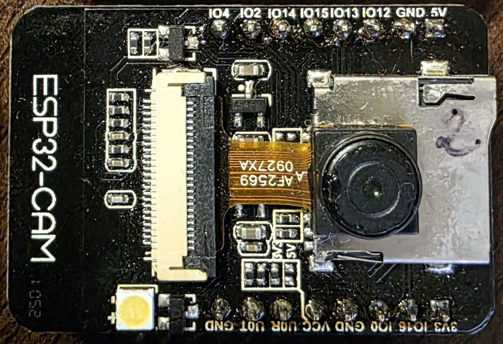
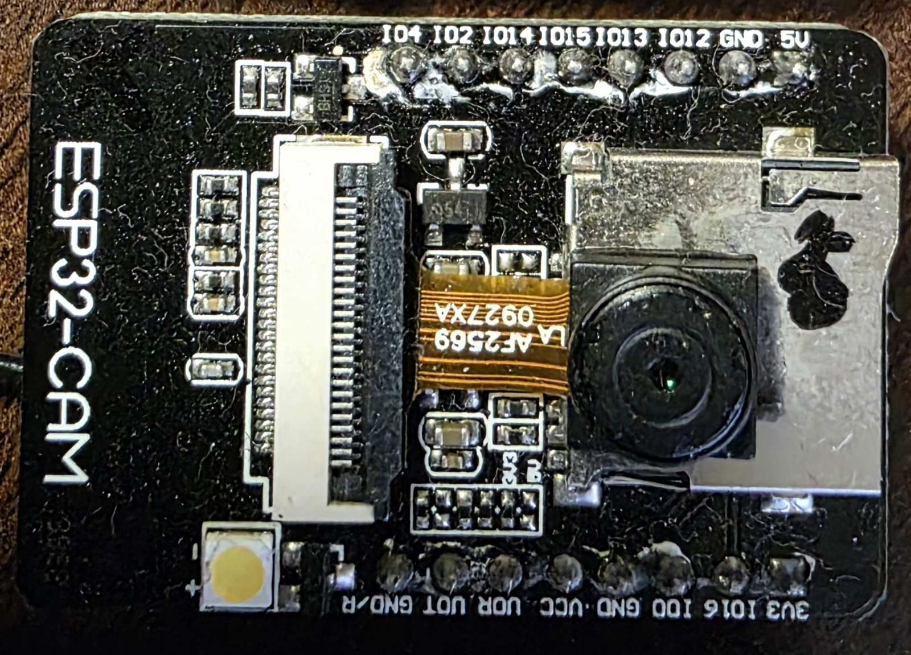
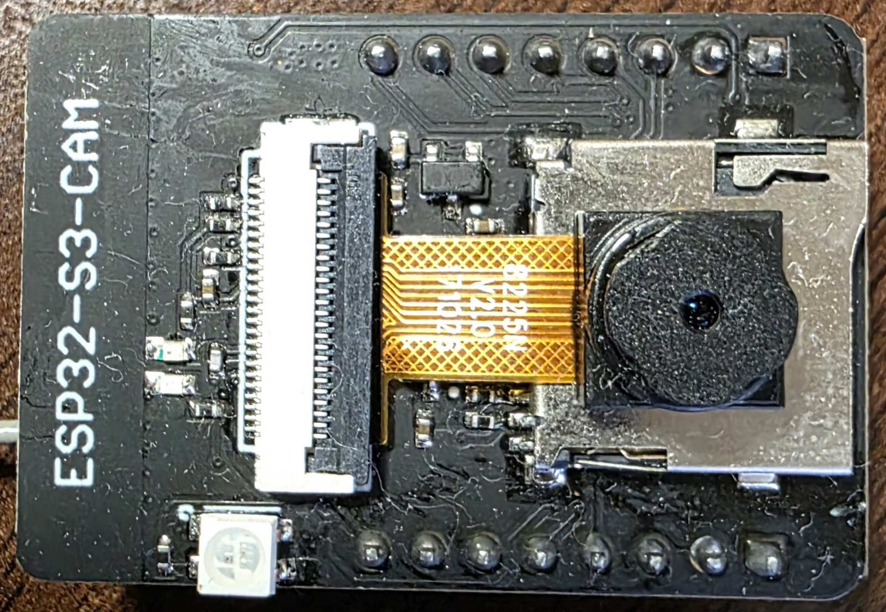
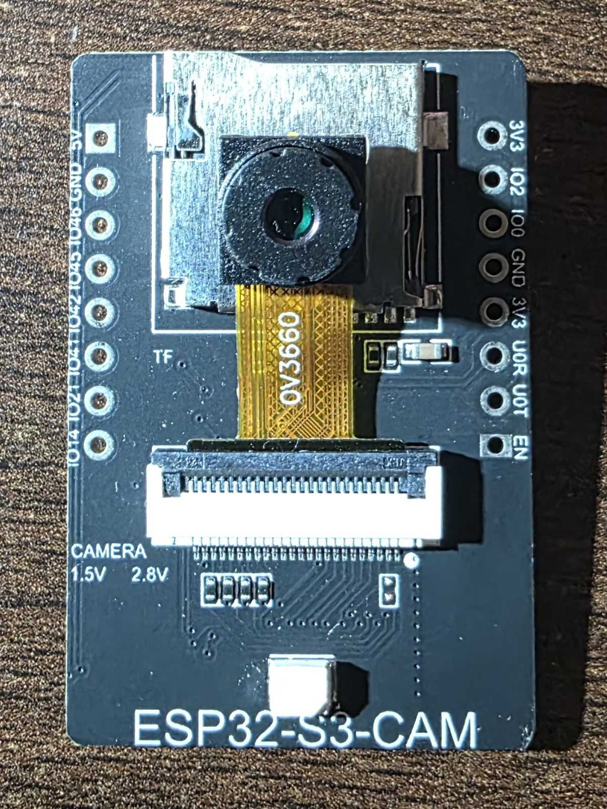
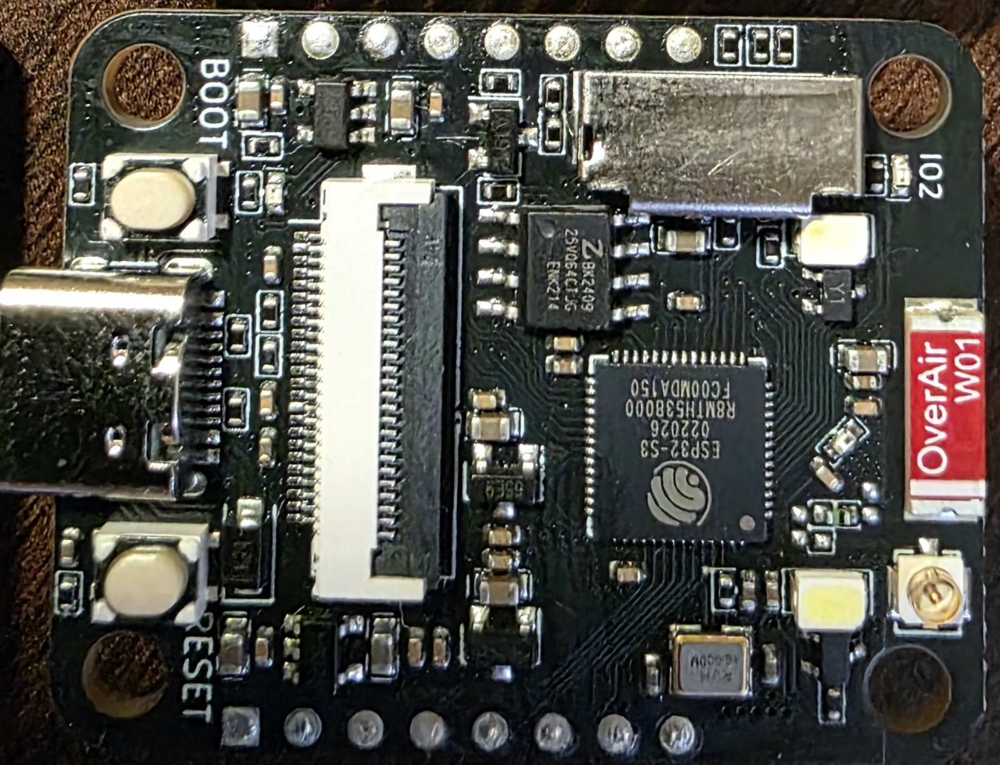
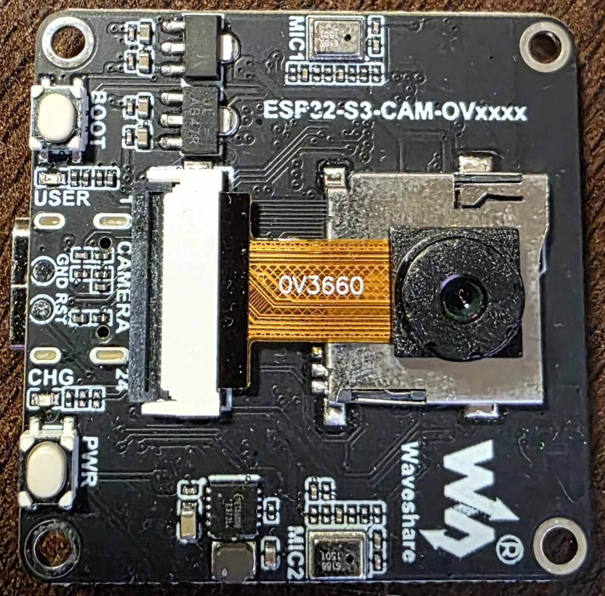
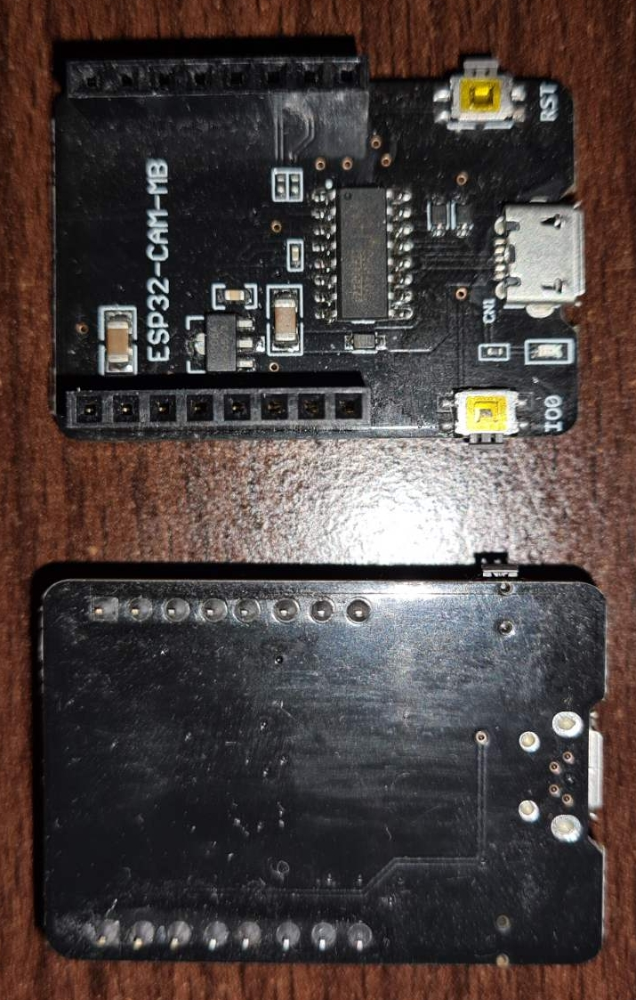
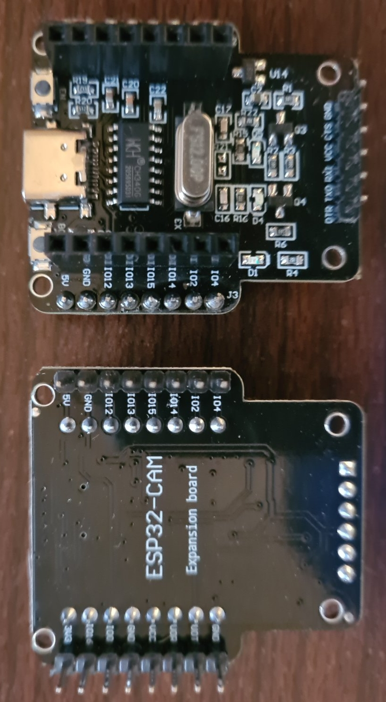
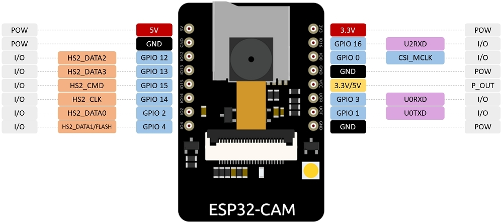

# esp32-cam
ESP32 Cam - TimeLapse, Streaming, Prusa Connect ..

---

# 🔧 Hardware

The project is designed primarily for **ESP32-CAM boards with an OV2640 camera** but ie OV3660 works just fine. 

### ESP32-CAM variants

| Picture                                        | Description              | Notes                      |
| ---------------------------------------------- | ------------------------ | -------------------------- |
|     | AI-Thinker - 'Original'  | 4x Rs                      |
|     | AI-Thinker - clone       | 6x Rs                      |
|  | ESP32 S3 - ver1          | NeoPixel at IO48           |
|  | ESP32 S3 - ver2          | reverse pullup LED at IO01 |
|  | ESP32 S3 - ver3          | normal LED at IO03         |
|  | ESP32 S3 - Waveshare     | no FlashLED at all         |

---

## Flashing HW helper boards
- CH340 chip, USB micro<br>


- CH340 chip, USB C, passtru dupont connectors for prototyping<br>


## Pinout


## Instalation
Insert ESP32-CAM into helper board and connect it to PC.

### <a href=doc/vsc.md>Visual Studio Code with Platformio IDE</a>
### <a href=doc/ardino.md>Arduino IDE</a>

---

# 📷 Using the Camera

Once the firmware is running, connect to the IP address assigned by your DHCP server.

For example:

```text
http://192.168.x.y:8080/
```

Log in with the credentials configured in `credentials.h`.

---

# 🌐 Web Interface

## Useful URLs
Web server listening port is 8080, changed from default 80 for easier router port-mapping, configurable at start of <a href=src/asyncWebServer.cpp>Web Server code</a>

| URL         | Description                                           |
| ----------- | ----------------------------------------------------- |
| `/login`    | Web authentication                                    |
| `/espReset` | Force a complete ESP32 reset                          |
| `/sdcard`   | Reinitialize the SD card after inserting/replacing it |
| `/archive`  | Browse saved time-lapse images                        |
| `/prusa`    | Upload the latest captured image to Prusa Connect     |

Example:

```text
http://{CAM_IP}:8080/login
http://{CAM_IP}:8080/espReset
http://{CAM_IP}:8080/sdcard
http://{CAM_IP}:8080/archive
http://{CAM_IP}:8080/prusa
```

---

## Configuration details
- <a href=include/camera.h>Camera Model</a><br>
    uncomment only one of the #define that is correct for your camera board<br>
    if you are using ESP32S3-CAM also copy <a href=doc/esp32s3cam.json>ESP32S3-CAM board definition</a> to PlatformIO dir C:\Users\...\.platformio\platforms\espressif32\boards dir and use 'board = esp32s3cam' in <a href=platformio.ini>PlatformIO ini</a>
- <a href=include/variables.h>Config Definitions</a><br>
    several interesting #defines
    - set `#undef HAVE_CAMERA` if you don't want to use camera (OV sensor misbehaving or similar)
    - set `ESP_CAM_HOSTNAME` for your cam board name
    - set `CAM_SERIAL` if you have several camera boards
    - set `FLASH_ENABLED true` if you want to use flash LED
    - set `#undef HAVE_SDCARD` if you don't want to use microSD
    - set `TIME_LAPSE_MODE true` for camera board to start saving photos in intervals to microSD
- Prusa Connect Setup<br>
    - login to <a href=https://connect.prusa3d.com>Prusa Connect</a>
    - choose registered printer
      - open 'Camera' menu
      - click on 'Add new other camera' and note Token text (copy to clipboard)
      - paste that text in <a href=include/credentials.h>credentials</a> line<br>
        `static const char* prusaToken = "paste_here";`<br>
      - generate fingerprint text with ```uuidgen``` command and paste that text in <a href=include/credentials.h>credentials</a> also<br>
      - compile and upload the firmware to the cam board, in a minute or so picture should be appearing on Prusa Printer Web

## ToDo
- [] add AP/Config mode at the very first start
- [] add GUI config mode for hardcoded #defines
- [] rewrite archive GUI to be much more pwetty
- [] better doc about all hardcoded links
- [] better doc about PC USB drivers

