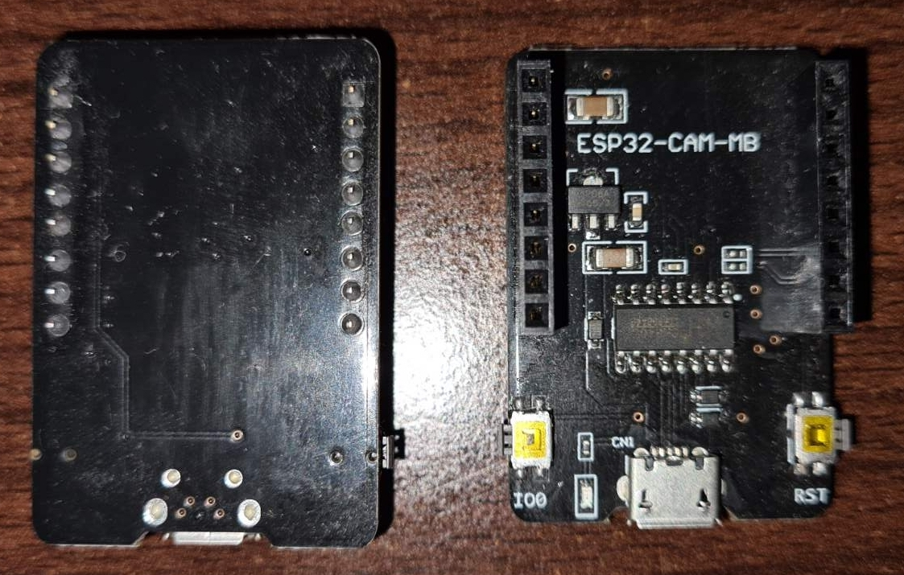
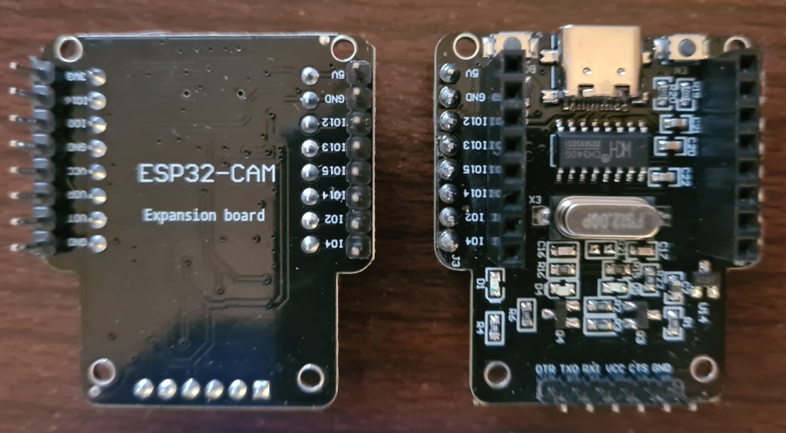

# esp32-cam
ESP32 Cam - TimeLapse, Streaming, ..

## Hardware
- ESP32-CAM board with OV2640 camera module
there are several hardware versions of the board
- original AI-Thinker board
- different copies, some exact some with notable differences
- S3 version with more PSRAM, faster

## Flashing HW helper boards
- CH340 chip, USB micro


- CH340 chip, USB C, passtru dupont connectors for prototyping


## Pinout


## Instalation
Insert ESP32-CAM into helper board and connect it to PC.

#### Visual Studio Code with PlatformIO IDE
Open Visual Studio Code and choose 'Open Folder' where this source is unpacked. If this is the very first time using PlatformIO, VSC will do some install and config magic and probably few GUI restarts.
Before compiling check file include/credentials_sample.h, fill it with actual WiFi credentials and rename the file to credentials.h.
Next check file platformio.ini for upload/flashing details, first time should be wire connection -
```
; upload_port = 192.168.x.y
; upload_protocol = espota
upload_protocol = esptool
```
after succesfull first flash OTA is also possible, 'Serial Monitor' option can be used to find out DHCP assigned IP -
```
upload_port = 192.168.x.y
upload_protocol = espota
; upload_protocol = esptool
```
Two more steps and we're done -
- Explorer - PlatformIO: Upload
- PlatformIO - esp32cam - Upload Filesystem Image

#### Arduino IDE
Gremlins ate this part - rewrite needed ..

## Using Camera
Connect to the DHCP assigned IP and enjoy!
#### Notable Weblinks
- {CAM_IP}/login<br>
    enter credentials
- {CAM_IP}/espReset<br>
    force complete ESP32-CAM reset
- {CAM_IP}/sdcard<br>
    reinit SD Card after (re)inserting microSD
- {CAM_IP}/scan<br>
    JSON display of neighbour WiFi SSID/Channels
- {CAM_IP}/archive<br>
    browse saved timelapse pictures

## ToDo
- add AP/Config mode at the very first start
- rewrite archive GUI to be much more prettier

